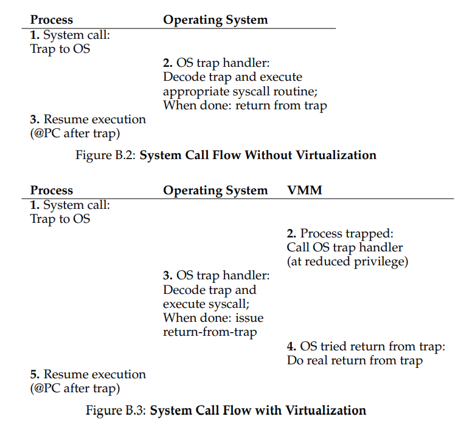
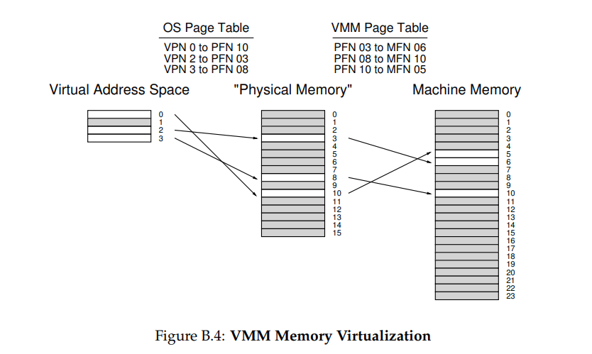
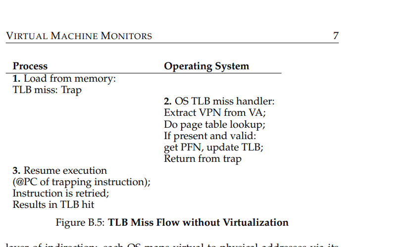

# Virtual Machine Monitors (VMMs) / Hypervisors

This chapter from the OSTEP book (Appendix B) introduces Virtual Machine Monitors (VMMs), their history, motivations, and techniques for virtualizing hardware (CPU and memory) beneath operating systems. It focuses on transparency: the OS believes it controls the hardware, but the VMM manages resources. The discussion draws from the Disco VMM (precursor to VMware) on MIPS architecture.

## Key Concepts

- **VMM Role**: Acts as an "OS for OSes" at a low level, multiplexing hardware across multiple OSes while maintaining the illusion of direct hardware control.
- **The Crux**: How to transparently virtualize the machine under the OS.
- **Transparency Goal**: OSes run unmodified (ideally), but VMM interposes on privileged operations.

## Introduction (B.1)

- **Historical Context**: Originated with IBM mainframes in the 1960s-70s to run multiple OSes on expensive hardware [G74].
- **Core Idea**: VMM sits between OS(es) and hardware, providing each OS the illusion of full control.
- **Challenges**: OS is used to being "in charge"; VMM must virtualize CPU, memory, etc., transparently.
- **Analogy**: OS virtualizes for apps (e.g., private CPU/memory); VMM does the same for OSes.

## Motivation: Why VMMs? (B.2)

- **Modern Revival (1990s)**: Led by Stanford's Disco project [B+97] on MIPS, which inspired VMware [V98].
- **Reasons**:
    - **Server Consolidation**: Run multiple lightly-loaded OSes on fewer machines to reduce costs and ease admin.
    - **Desktop Functionality**: Run one primary OS (e.g., Linux/Mac) with access to apps from another (e.g., Windows).
    - **Testing/Debugging**: Developers test code across multiple OS types/versions on one machine.
- **Broader Impact**: Enables efficient resource sharing without OS modifications.

## Virtualizing the CPU (B.3)

- **Technique**: _Limited Direct Execution_ (similar to OS process virtualization).
    - Boot OS by jumping to its first instruction.
    - On single CPU: Multiplex OSes via _machine switch_ (save/restore full machine state: registers, PC, privileged hardware).
- **Handling Privileged Operations**:
    - OS can't execute privileged instructions (e.g., TLB updates); VMM intercepts via traps.
    - **System Call Example** (e.g., open() on FreeBSD):
        - User app traps (e.g., int 80h on x86).
        - Without VMM: Hardware switches to kernel mode, jumps to OS trap handler.
        - With VMM: Trap goes to VMM, which jumps to OS handler (at reduced privilege), handles syscall, then VMM performs real return-from-trap.
- **Figures**:
    - B.1/B.2: System call flow without virtualization (direct trap to OS).
    - B.3: With virtualization (VMM interposes, more steps → potential slowdown).
- **OS Mode**: Can't run in kernel mode (loses control). Use supervisor mode (MIPS) or user mode with page protections to access OS data structures.
- **Performance Note**: Extra traps slow system calls.

## Virtualizing Memory (B.4)

- **Extra Indirection Layer**:
    - OS sees "physical" memory (linear pages assigned to itself/processes).
    - VMM maps OS "physical" frames (PFNs) to real _machine_ frames (MFNs).
    - Per-OS page tables in VMM; per-process page tables in each OS.
- **Figure B.4**: Example mapping: Virtual → Physical (OS page table) → Machine (VMM page table).
- **Address Translation (Software-Managed TLB)**:
    - Without VMM: TLB miss → trap to OS handler → lookup VPN-to-PFN → install in TLB.
    - With VMM: TLB miss → VMM handler → call OS handler → OS tries VPN-to-PFN (traps to VMM) → VMM installs VPN-to-MFN.
- **Figures**:
    - B.5: TLB miss without virtualization.
    - B.6: With virtualization (more traps → expensive).
- **Hardware-Managed TLBs (Aside)**: VMM maintains _shadow page tables_ mapping virtual-to-machine directly; installs them when OS updates its tables [AA06].
- **Optimization (Disco)**: VMM software TLB caches seen mappings to skip OS interposition on misses.
- **VMM Management**: Tracks physical-to-machine mappings; can swap pages to disk.

## The Information Gap (B.5)

- **Problem**: VMM lacks insight into OS intentions (semantic gap), leading to inefficiencies.
- **Examples**:
    - **Idle Loop**: OS spinPasted image 20251212213737.png)s (while(1);) when idle, wasting CPU. VMM could allocate more time to busy OSes but doesn't detect idleness.
    - **Demand Zeroing**: Both VMM and OS zero pages for security → redundant work.
- **Solutions**:
    - **Implicit Information**: Infer from actions (e.g., OS low-power mode signals idle).
    - **Para-Virtualization**: Modify OS for efficiency (e.g., skip zeroing if VMM did it) [WSG02, BD+03]. Not always feasible (requires OS source access).
- **Tip**: Use inference in layered systems without API changes [AD+01, S+03].

## Summary (B.6)

- **VMM vs. OS Virtualization**: Both virtualize hardware, but OS provides new abstractions/interfaces; VMM replicates hardware exactly (less user-friendly).
- **Other Topics** (Not Covered in Depth):
    - I/O Virtualization: New issues in hosted setups [SVL01].
    - Memory Overcommitment: Handling when OSes exceed physical memory.
    - Hosted Configuration: VMM runs alongside OS.
    - Modern Hardware Support: Intel/AMD extensions reduce software tricks [B+17].
- **Renaissance**: VMMs popular for consolidation, flexibility; transparent via limited direct execution and trap interposition.

## References

- Key papers: [B+97] (Disco), [BD+03] (Xen para-virtualization), [G74] (Survey), [WSG02] (Denali).
- Full list in document (pages 13).

These notes are concise for quick reference. For full details, refer to the original PDF or OSTEP book (Version 1.10).