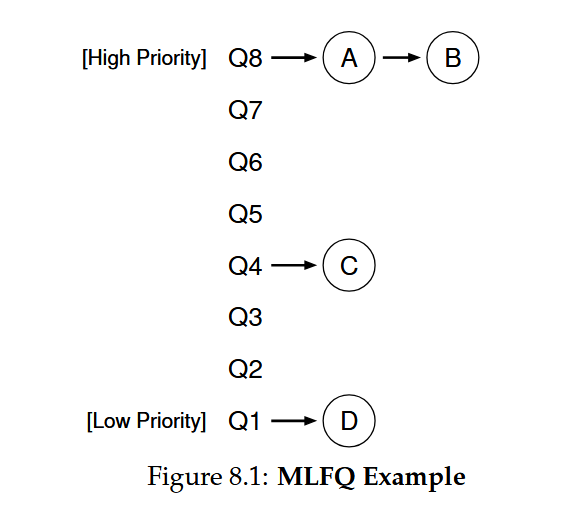

**MLFQ (Multi-Level Feedback Queue) Basic Rules**

- **Multiple Queues**: MLFQ has distinct queues with different priority levels.

- **Priority-Based Scheduling**: The job with the highest priority (i.e., on the highest queue) is chosen to run.

- **Basic Rules**:

- **Rule 1**: If Priority(A) > Priority(B), A runs (B doesn’t).

- **Rule 2**: If Priority(A) = Priority(B), A & B run in Round Robin (RR).

**Key Concepts**

- **Dynamic Priority Adjustment**: MLFQ varies a job's priority based on its observed behavior.

- **Learning from History**: MLFQ uses the history of a job to predict its future behavior.

- **Prioritizing Interactive Processes**: MLFQ keeps the priority high for jobs that relinquish the CPU while waiting for input (e.g., interactive processes).

- **Reducing Priority for CPU-Intensive Jobs**: MLFQ reduces the priority for jobs that use the CPU intensively for long periods.

**Important Ideas**

- **History-Based Prediction**: MLFQ learns from the past to predict future behavior, which works well for jobs with predictable phases of behavior.

- **Caution**: Such techniques can be wrong and lead to worse decisions if not implemented carefully.

