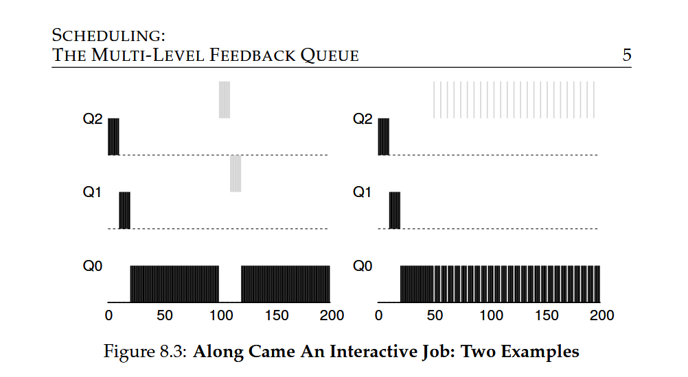

# **MLFQ Priority Adjustment Algorithm (Attempt #1)**

- **Job Allotment**: The amount of time a job can spend at a given priority level before its priority is reduced.

- **Initial Priority**: A new job enters the system at the highest priority (topmost queue).

- **Priority Adjustment Rules**:

- **Rule 3**: New job enters at highest priority.

- **Rule 4a**: If a job uses up its allotment, its priority is reduced (moves down one queue).

- **Rule 4b**: If a job gives up the CPU before using up its allotment (e.g., for I/O), its priority stays the same (allotment is reset).

These rules aim to:

- Prioritize interactive jobs that frequently relinquish the CPU

- Reduce priority for CPU-bound jobs that use up their allotment

### **Example 1: Single Long-Running Job**

- A long-running job enters the system at the highest priority (Q2).

- After using up its allotment (10 ms), the job's priority is reduced, and it moves down to Q1.

- After another time slice, the job's priority is reduced again, and it moves to the lowest priority (Q0).

- The job remains at the lowest priority (Q0) for the remainder of its execution.

### **Example 2: Short Job Arrival**

- A long-running CPU-intensive job (A) is running at the lowest priority (Q0).

- A short-running interactive job (B) arrives and is inserted into the highest queue (Q2).

- Job B runs at high priority and completes quickly (within 2 time slices) before reaching the bottom queue.

- Job A resumes running at low priority (Q0).

### **Example 3: I/O-Bound Job**

- If a job relinquishes the CPU before using up its allotment (e.g., for I/O), its priority remains the same.

- This rule helps interactive jobs that frequently perform I/O operations, keeping them at high priority.

### **Problems with Current MLFQ**

- **Starvation**: Too many interactive jobs can consume all CPU time, starving long-running jobs.

- **Gaming the Scheduler**: A job can exploit the scheduler by issuing I/O operations before using up its allotment, allowing it to remain in a high-priority queue and monopolize the CPU.

- **Changing Job Behavior**: A job's behavior may change over time, but the current approach doesn't adapt well to these changes.