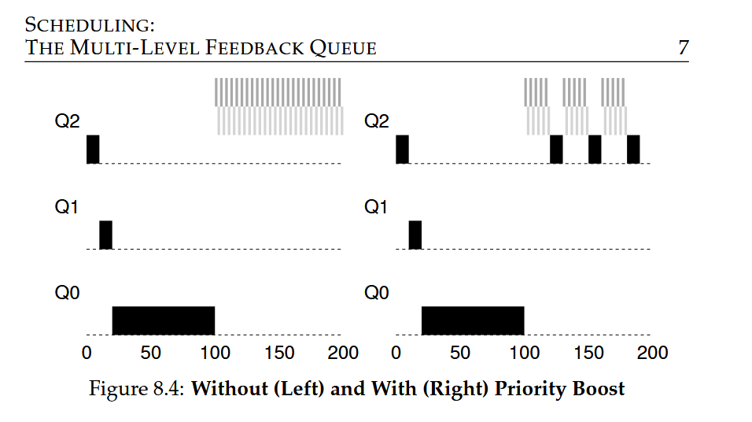

### **Attempt #2: Priority Boost**

- **Problem**: Starvation of CPU-bound jobs due to interactive jobs consuming all CPU time.

- **Solution**: Periodically boost the priority of all jobs in the system by moving them to the topmost queue.

- **New Rule**:

- **Rule 5**: After some time period S, move all jobs in the system to the topmost queue.

**Benefits**

- **Prevents Starvation**: Guarantees CPU-bound jobs will make some progress.

- **Treats Interactive Jobs Properly**: If a CPU-bound job becomes interactive, it will be treated properly after the priority boost.

**Challenges**

- **Setting the Time Period S**: Finding the right value for S is crucial; too high and long-running jobs may starve, too low and interactive jobs may not get a proper share of the CPU.

- **Voo-doo Constants**: S is a value that requires careful tuning, often left to system administrators or automatic methods based on machine learning