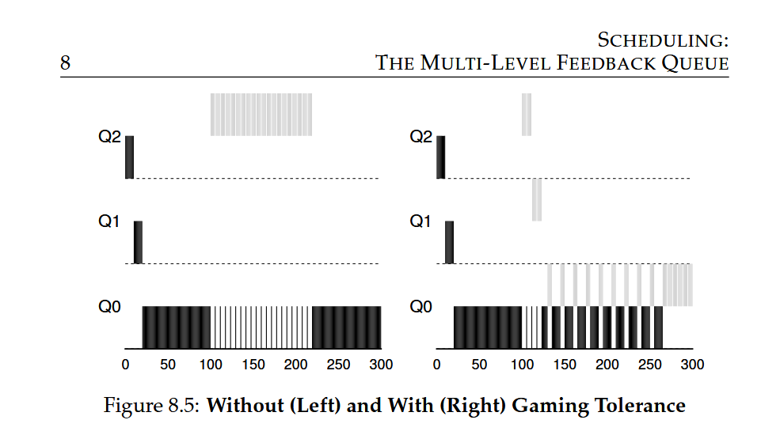

**Problem:** Gaming of the scheduler due to Rules 4a and 4b, which allow a job to retain priority by relinquishing CPU before allotment expires.

**Solution:**

- Better accounting of CPU time at each level of MLFQ

- Keep track of CPU usage even after I/O operations

- Demote process to next priority queue once time allotment is used up

**New Rule 4:**

- Once a job uses up its time allotment at a given level, its priority is reduced (moves down one queue), regardless of number of times it gives up CPU.

**MLFQ Scheduling**

- **Parameterization**: No easy answers to questions like:

- How many queues?

- Time slice size per queue?

- Allotment?

- Priority boost frequency?

- **Time slice length**: Varies across queues:

- High-priority queues: short time slices (e.g., 10 ms)

- Low-priority queues: longer time slices (e.g., 100s of ms)

- **Configuration**: Some implementations (e.g., Solaris) provide tables for configuration, while others use mathematical formulae (e.g., FreeBSD)

**Additional Features**

- **Reserved priorities**: Some schedulers reserve highest priority levels for OS work

- **User advice**: Interfaces allow users to provide hints to the OS, e.g., `nice` command to adjust priority

- **Advice usage**: Useful in many parts of the OS, including scheduler, memory manager, and file system

**Notes**

- Experience and tuning are necessary for satisfactory balance

- Different schedulers have varying implementations and rules