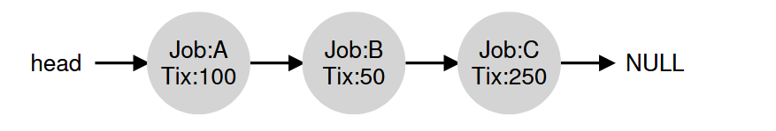

# Key Points: Implementation of Lottery Scheduling

- **Simple Implementation**: Lottery scheduling is easy to implement, requiring:

- A good random number generator.

- A data structure to track processes (e.g., a list).

- The total number of tickets.

- **Scheduling Decision**: To make a scheduling decision:

- Pick a random number (winner) from the total number of tickets.

- Traverse the process list, adding ticket values to a counter until it exceeds the winner.

- The process at which the counter exceeds the winner is the winner.

- **Efficiency**: Organizing the list in sorted order (highest to lowest tickets) can improve efficiency by reducing the number of list iterations.

- **Correctness**: The ordering of the list does not affect the correctness of the algorithm.



To make a scheduling decision, we first have to pick a random number
(the winner) from the total number of tickets (400)2 Let’s say we pick the
number 300. Then, we simply traverse the list, with a simple counter
used to help us find the winner (Figure 9.1).
The code walks the process list, adding each ticket value to counter
until the value exceeds winner. Once that is the case, the current list el-
ement is the winner. With our example of the winning ticket being 300,
the following takes place. First, counter is incremented to 100 to ac-
count for A’s tickets; because 100 is less than 300, the loop continues.
Then counter would be updated to 150 (B’s tickets), still less than 300
and thus again we continue. Finally, counter is updated to 400 (clearly
greater than 300), and thus we break out of the loop with current point-
ing at C (the winner).

```c
// C code for getting random ticket, looping through linked list and 
// finding if the ticket counter is greater > randomly generated number
// counter: used to track if we’ve found the winner yet
int counter = 0;

// winner: call some random number generator to
// get a value >= 0 and <= (totaltickets - 1)
int winner = getrandom(0, totaltickets);

// current: use this to walk through the list of jobs
node_t *current = head;
while (current) {
    counter = counter + current->tickets;
    if (counter > winner)
        break; // found the winner
    current = current->next;
}
// ’current’ is the winner: schedule it...
```
Keep the list sorted for efficiency.