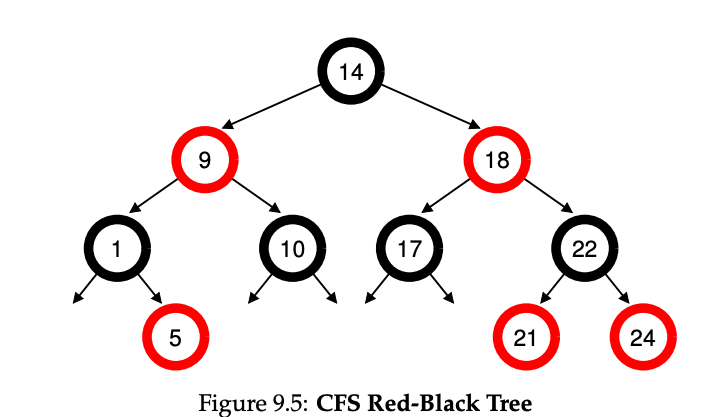

### Key Notes on Using Red-Black Trees in CFS (Completely Fair Scheduler)

1. **Efficiency Focus**:
    
    - The scheduler must quickly find the next job to run to maintain efficiency.
    - Simple data structures like lists do not scale well for systems with thousands of processes.
2. **Red-Black Tree Usage**:
    
    - CFS uses a **red-black tree**, a type of balanced binary tree, to manage processes efficiently.
    - Balanced trees maintain low depths, ensuring operations like insertion, deletion, and search are logarithmic in time (**O(log n)**), unlike linear time (**O(n)**) for lists.
3. **Processes in the Tree**:
    
    - Only **running or runnable processes** are kept in the red-black tree.
    - Processes that are sleeping (e.g., waiting for I/O or network packets) are removed from the tree and tracked elsewhere.
4. **Example of Efficiency**:
    
    - For 10 jobs with `vruntime` values (e.g., 1, 5, 9, 10, etc.):
        - In an **ordered list**, finding the next job is simple, but reinserting it in the correct position takes **O(n)** time.
        - In a **red-black tree**, insertion, deletion, and search are all **O(log n)**, making it significantly more efficient for large numbers of processes.
5. **Scalability**:
    
    - Red-black trees ensure that operations remain efficient even when the number of processes (`n`) is in the thousands, making them ideal for modern systems.

### Red Black Tree
**Red-black tree** is a type of **binary search tree (BST)**, but with additional properties that ensure it remains **balanced**. Like a standard BST:

- **Smaller values** are stored on the **left**.
- **Larger values** are stored on the **right**.

However, unlike a simple binary search tree, a red-black tree includes specific rules to maintain balance, preventing it from degenerating into a linked list (which can happen in a regular BST under certain insertion patterns). These rules ensure that the tree's height is kept logarithmic relative to the number of nodes, making operations like insertion, deletion, and search efficient.

### Key Properties of a Red-Black Tree:

1. **Node Colors**:
    - Each node is either **red** or **black**.
2. **Root is Black**:
    - The root of the tree is always **black**.
3. **Red Nodes Have Black Children**:
    - A red node cannot have a red child (no two consecutive red nodes).
4. **Black Height**:
    - Every path from a node to its descendant null pointers (leaves) must have the same number of **black nodes**.
5. **Balanced Tree**:
    - These properties ensure the tree remains approximately balanced, with a height of at most **2 × log(n + 1)**.

### Why Red-Black Trees Are Better Than Simple BSTs:

- In a regular BST, the tree can become unbalanced (e.g., all nodes on one side), leading to **O(n)** operations in the worst case.
- Red-black trees maintain balance dynamically during insertions and deletions, ensuring **O(log n)** time complexity for operations.

In the context of the **Completely Fair Scheduler (CFS)**:

- The `red-black tree is used to store **runnable processes**`, ordered by their **vruntime** (virtual runtime).
- This allows the scheduler to efficiently find, insert, and remove processes while maintaining fairness and performance.
