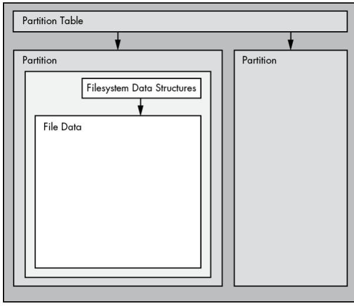
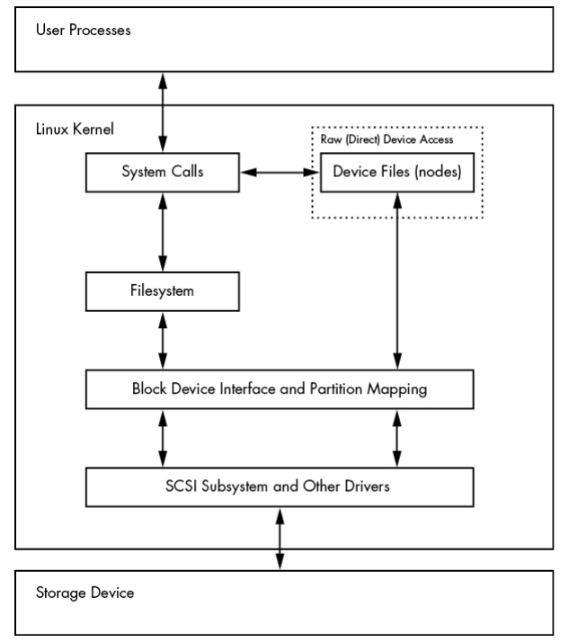

### Partition


### Create Partitions
- List devices using `lsblk`.
- View parition using `parted -l` or `fdisk -l`.
- fdisk is interactive, changes will not be commited until we enter `w` command.
- `fdisk /dev/sdd` to start paritioning.
- `Command (m for help): p`: prints parition.
- `d` delete existing parition, usually there are so we need to get rid of them first.
- `n` to create new parition.
    - Partition type 
        p   primary (0 primary, 0 extended, 4 free) 
        e   extended (container for logical partitions) 
    Select (default p): `p` # p for primary 
    Partition number (1-4, default 1): `1` 
    First sector (2048-8368127, default 2048): `2048`
    Last sector, +sectors or +size{K,M,G,T,P} (2048-8368127, default 8368127): `+200M` # for 200MB size, leave empty if we wanna use it all
    Created a new partition 1 of type 'Linux' and of size 200 MiB.
- `w` to write parition.


# Background

## What is a Partition?

- A **partition** is a subdivision of a physical disk.
- Linux represents partitions by appending a number to the disk device name:
    - `/dev/sda1` → Partition 1 on disk `/dev/sda`
    - `/dev/sdb3` → Partition 3 on disk `/dev/sdb`
- The kernel treats each partition as its own **block device**, just like an entire disk.

### Example

```
Disk: /dev/sda
├── /dev/sda1
├── /dev/sda2
└── /dev/sda3
```

---

## Partition Table (Disk Label)

- Partitions are defined in a special area of the disk called the:
    - **Partition Table**
    - **Disk Label** (another name for the same thing)
- The partition table stores:
    - Partition boundaries
    - Partition sizes
    - Partition types


---

## Why Create Multiple Partitions?

Historically, multiple partitions were common for several reasons:

### 1. Boot Limitations

- Older PCs could only boot from certain regions of a disk.
- Administrators created partitions to ensure boot files were in accessible locations.

### 2. Space Management

- Administrators could reserve disk space for the operating system.
- Prevented users from filling the entire disk and causing critical services to fail.

### Example

```
Disk
├── OS Partition     (20 GB)
├── User Data        (200 GB)
└── Swap             (8 GB)
```

Even today:

- Many Windows systems use multiple partitions.
- Most systems still have a dedicated **swap partition**.

---

## Accessing Entire Disks vs Partitions

Linux allows access to:

1. The entire disk device
2. Individual partitions

Example:

```
Entire disk:     /dev/sda
Partition:       /dev/sda1
```

The kernel allows both to be accessed simultaneously.

### Typical Usage

Normally, you access:

```
/dev/sda1
```

rather than:

```
/dev/sda
```

### Exception

Accessing the entire disk is useful when:

- Cloning disks
- Creating backups
- Copying disk images

Example:

```
dd if=/dev/sda of=disk_backup.img
```

---

## Logical Volume Manager (LVM)

Linux provides the **Logical Volume Manager (LVM)** to make storage management more flexible.

### Benefits

- Resize storage dynamically
- Combine multiple disks into larger logical volumes
- Easier storage administration

### Layer Position

LVM sits between:

- Physical storage devices
- Filesystems

```
Disk
  ↓
Partition
  ↓
LVM
  ↓
Filesystem
```


---

## Filesystems

Above partitions sits the **filesystem**.

### What is a Filesystem?

A filesystem is a database-like structure that stores:

- Files
- Directories
- Metadata

Examples:

- ext4
- XFS
- Btrfs

Users interact primarily with the filesystem rather than directly with disk blocks.

---

## How Linux Finds a File

To access file data:

### Step 1

Use the partition table to locate the correct partition.

### Step 2

Read the filesystem stored on that partition.

### Step 3

Search the filesystem metadata for the requested file.

### Step 4

Locate and read the file's data blocks.

### Visualization

```
Physical Disk
     ↓
Partition Table
     ↓
Partition
     ↓
Filesystem
     ↓
File Metadata
     ↓
File Data Blocks
```


---

## Linux Disk Access Layers

Linux accesses storage through multiple layers.

### Simplified Stack

```
User Program
      ↓
Filesystem
      ↓
Block Device Layer
      ↓
Partition
      ↓
Disk Device
      ↓
SCSI/Storage Subsystem
      ↓
Hardware
```

### Important Observation

Linux provides two ways to access storage:

#### Through the Filesystem

Normal user operations:

```
cat file.txt
cp file1 file2
vim notes.txt
```

Path:

```
Application
    ↓
Filesystem
    ↓
Disk
```

#### Direct Disk Access

Utilities can bypass the filesystem:

```
dd if=/dev/sda1 of=image.img
```

Path:

```
Application
    ↓
Block Device
    ↓
Disk
```

This is useful for:

- Disk imaging
- Recovery tools
- Filesystem creation
- Low-level disk utilities

---

## What is a Partition Table?

A **partition table** is simply a data structure stored on a disk that describes how the disk's blocks are divided into partitions.

It does **not** contain file data or directories.

Its job is only to answer questions such as:

- Where does a partition start?
- Where does it end?
- What type of partition is it?

### Visualization

```
Disk
┌──────────────────────────────────┐
│ Partition Table                  │
├─────────────┬───────────┬────────┤
│ Partition 1 │ Partition2│ Part 3 │
└─────────────┴───────────┴────────┘
```

The partition table is essentially a map of the disk.

---

# MBR vs GPT

## MBR (Master Boot Record)

The traditional partition table format used since the early PC era.

### Characteristics

- Stored in the first sector of the disk.
- Supported by virtually all operating systems.
- Has several limitations.

### Major Limitations

- Maximum disk size of approximately **2 TB**.
- Supports only **4 primary partitions**.
- Stores partition information in a small area.
- Less resilient to corruption.

### Visualization

```
Disk
┌─────┬─────────────────────────────┐
│ MBR │ Partitions                  │
└─────┴─────────────────────────────┘
```

---

## GPT (GUID Partition Table)

Modern replacement for MBR.

GUID = **Globally Unique Identifier**

### Advantages

- Supports very large disks (well beyond 2 TB).
- Supports many partitions (typically 128 by default).
- Stores backup partition tables for redundancy.
- Better reliability and error detection.

### Visualization

```
Disk
┌────────┬──────────────────────┬────────┐
│ GPT    │ Partitions           │ Backup │
│ Header │                      │ GPT    │
└────────┴──────────────────────┴────────┘
```

### Why GPT Won

As disks grew larger and systems became more complex, MBR's limitations became problematic.

Modern Linux installations typically use:

```
GPT + UEFI
```

instead of:

```
MBR + BIOS
```

---

# Linux Partitioning Tools

Linux provides several tools for viewing and modifying partition tables.

---

## 1. parted

**Partition Editor**

### Features

- Text-based interface
- Supports both MBR and GPT
- Good for scripting
- Can display partition information easily

### Example

Show partitions:

```
sudo parted /dev/sda print
```

Example output:

```
Model: SSD
Disk /dev/sda: 500GB
Partition Table: gpt

Number  Start   End     Size
1       1MB     512MB   511MB
2       512MB   500GB   499GB
```

---

## 2. gparted

Graphical version of `parted`.

### Features

- GUI interface
- Visual partition layout
- Easy resizing and creation of partitions

### Visualization

```
┌────────────────────────────┐
│ [Partition 1][Partition 2] │
└────────────────────────────┘
```

Useful when working from a desktop environment.

---

## 3. fdisk

Traditional Linux partitioning utility.

### Features

- Text-based
- Interactive
- Supports:
    - MBR
    - GPT
    - Many other partition table formats

### Example

```
sudo fdisk /dev/sda
```

Once inside:

```
Command (m for help):
```

You can:

|Command|Action|
|---|---|
|`p`|Print partition table|
|`n`|Create partition|
|`d`|Delete partition|
|`w`|Write changes|
|`q`|Quit without saving|

---

# Why Many Administrators Like fdisk

The book highlights an important usability advantage.

With `fdisk`:

- Changes are staged in memory.
- Nothing is written immediately.
- You can review your work before committing changes.

Example workflow:

```
Create partition
      ↓
Review layout
      ↓
Make corrections
      ↓
Write changes (w)
```

Only after pressing:

```
w
```

are the changes written to disk.

This reduces the risk of accidental modifications.

---

# Why Use Both parted and fdisk?

The author chooses:

|Tool|Purpose|
|---|---|
|`parted`|Display partition information|
|`fdisk`|Create and modify partitions|

Reason:

- `parted` is convenient for querying partition tables.
- `fdisk` provides a safer and more interactive editing experience.

---

# Important: Partitioning vs Filesystems

The book stresses that these are two completely different concepts.

## Partitioning

Defines **boundaries on the disk**.

Example:

```
Partition 1: 100 GB
Partition 2: 200 GB
Partition 3: 50 GB
```

Partitioning only determines where partitions begin and end.

---

## Filesystem Creation

Creates the data structures used to store:

- Files
- Directories
- Metadata

Example:

```
sudo mkfs.ext4 /dev/sda1
```

This builds an ext4 filesystem inside the partition.

---

## Relationship

```
Physical Disk
       ↓
Partition Table
       ↓
Partition
       ↓
Filesystem
       ↓
Files and Directories
```

A partition by itself cannot store files meaningfully until a filesystem is created on it.

# Key Takeaways

- A **partition table** is simply metadata describing how a disk is divided.
- The two major partition table formats are:
    - **MBR** (older, limited)
    - **GPT** (modern, preferred)
- Common Linux partitioning tools:
    - `parted`
    - `gparted`
    - `fdisk`
- `fdisk` is popular because changes are not written until explicitly confirmed with `w`.
- **Partitioning** defines disk boundaries.
- **Filesystems** organize data within those partitions.
- The storage hierarchy is:

```
Disk
  ↓
Partition Table
  ↓
Partition
  ↓
Filesystem
  ↓
Files
```