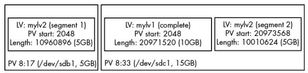
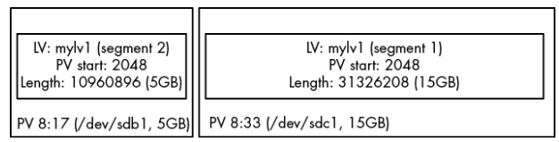

# 4.4.3 The LVM Implementation

## Overview

LVM (specifically **LVM2**) is primarily a **user-space system**. The Linux kernel does **not** scan disks or understand LVM metadata directly. Instead:

- **User-space LVM utilities** discover and interpret LVM metadata.
- The **kernel Device Mapper (DM)** performs block-level mapping between logical volumes and physical storage.
- LVM utilities communicate mapping information to the Device Mapper.
- The Device Mapper acts as a virtualization layer between filesystems and physical block devices.

### High-Level Architecture

```
Filesystem
    │
    ▼
Logical Volume (/dev/myvg/mylv1)
    │
    ▼
Device Mapper (Kernel)
    │
    ▼
Physical Volumes (/dev/sdb1, /dev/sdc1)
```

---

# LVM Physical Volume Discovery Process

Before any LVM command can perform work, it must discover the LVM structure present on the system.

### Steps Performed by LVM Utilities

1. Find all Physical Volumes (PVs).
2. Determine which Volume Groups (VGs) the PVs belong to.
3. Verify that all required PVs for each VG are present.
4. Discover all Logical Volumes (LVs).
5. Build the mapping between LVs and PVs.

### Physical Volume Metadata

Each PV contains a header that stores:

- PV identification
- VG membership information
- LV information
- UUIDs

LVM utilities read these headers and reconstruct the entire storage layout.

---

# Inspecting an LVM Header

To view raw metadata stored on a Physical Volume:

```bash
dd if=/dev/sdb1 count=1000 | strings | less
```

### Command Breakdown

|Command|Purpose|
|---|---|
|`dd`|Reads raw blocks from a device|
|`if=/dev/sdb1`|Input file (the PV)|
|`count=1000`|Read first 1000 blocks|
|`strings`|Extract printable strings from binary data|
|`less`|View output interactively|

### Example

```bash
dd if=/dev/sdb1 count=1000 | strings | less
```

This displays readable portions of the LVM metadata stored on the PV.

---

# LVM Commands That Perform PV Scanning

Any LVM utility can perform the PV discovery process.

Examples:

```
pvscan
```

```
lvs
```

```
vgcreate
```

### What They Do

|Command|Purpose|
|---|---|
|`pvscan`|Scan system for Physical Volumes|
|`lvs`|Display Logical Volumes|
|`vgcreate`|Create a Volume Group|

Before performing their primary task, these commands first scan available PVs and reconstruct the LVM configuration.

---

# The Device Mapper

After LVM determines the structure of VGs and LVs, it must inform the kernel.

This is done through:

```
LVM Utility
    │
 ioctl()
    │
    ▼
/dev/mapper/control
    │
    ▼
Device Mapper Driver
```

### Responsibilities of the Device Mapper

- Create logical block devices
- Maintain mapping tables
- Translate logical block addresses into physical locations
- Present LVs as normal block devices

---

# Device Mapper Control Interface

LVM communicates with the kernel through:

```
/dev/mapper/control
```

using the:

```c
ioctl(2)
```

system call.

### Key Point

The kernel itself does not understand LVM metadata; it simply receives completed mapping tables from LVM.

---

# Inspecting Device Mapper Devices

To list mapped devices:

```
dmsetup info
```

### Example Output

```
Name: myvg-mylv1
State: ACTIVE
Read Ahead: 256
Tables present: LIVE
Open count: 0
Event number: 0
Major, minor: 253, 1
Number of targets: 2
UUID: LVM1pHrOee5zyTUtK5gnNSpDYshM8Cbokf3OfwX4T0w2XncjGrwct7nwGhpp7l7J5aQ
```

### Important Fields

| Field             | Meaning                                 |
| ----------------- | --------------------------------------- |
| Name              | Device Mapper device name               |
| State             | Device state                            |
| Major, minor      | Device number                           |
| Number of targets | Number of mapping segments              |
| UUID              | Unique identifier for the mapped device |

---

# Device Mapper Device Files

From:

```
Major, minor: 253, 1
```

we know:

- Device Mapper major number = **253**
- Minor number = **1**

Therefore:

```
/dev/dm-1
```

is the actual kernel device file.

---

# Friendly Names via udev

The kernel creates:

```
/dev/dm-1
```

but users normally access:

```
/dev/mapper/myvg-mylv1
```

These symbolic links are automatically created by:

```
udev
```

when Device Mapper devices appear.

---

# Viewing Device Mapper Mapping Tables

To inspect the mapping table:

```
dmsetup table
```

### Example

```
myvg-mylv2: 0 10960896 linear 8:17 2048
myvg-mylv2: 10960896 10010624 linear 8:33 20973568
myvg-mylv1: 0 20971520 linear 8:33 2048
```

---

# Mapping Table Fields

For each entry:

```
myvg-mylv2: 0 10960896 linear 8:17 2048
```

the fields mean:

| Field      | Meaning                        |
| ---------- | ------------------------------ |
| `0`        | Start offset on logical volume |
| `10960896` | Length of segment              |
| `linear`   | Mapping type                   |
| `8:17`     | Source device (major:minor)    |
| `2048`     | Offset on source device        |

---

# Source Device Mapping

In the example:

|Major:Minor|Device|
|---|---|
|`8:17`|`/dev/sdb1`|
|`8:33`|`/dev/sdc1`|

---

# Example Layout: Two Logical Volumes

Physical Volumes:

```
/dev/sdb1 = 5 GB
/dev/sdc1 = 15 GB
```

Logical Volumes:

```
mylv1 = 10 GB
mylv2 = 10 GB
```

### LVM Allocation Strategy

#### mylv1

Stored entirely on:

```
/dev/sdc1
```

because it had enough contiguous space.

#### mylv2

Had to be split across:

```
/dev/sdb1
/dev/sdc1
```


because the remaining space was fragmented.

---

# After Removing mylv2 and Expanding mylv1

Viewing the updated mapping table:

```
dmsetup table
```

Output:

```
myvg-mylv1: 0 31326208 linear 8:33 2048
myvg-mylv1: 31326208 10960896 linear 8:17 2048
```

### Result

`mylv1` now spans:

```
/dev/sdc1
```

and

```
/ dev/sdb1
```

using the free space previously occupied by `mylv2`.

---

# Important Concepts

## LVM vs Device Mapper

|Component|Location|Responsibility|
|---|---|---|
|LVM Utilities|User Space|Discover PVs, VGs, LVs and build mappings|
|Device Mapper|Kernel Space|Translate logical block addresses to physical locations|

---

## Why LVM Uses User Space

Advantages:

- Simpler kernel
- Easier metadata parsing
- Easier upgrades
- No need for complex kernel scanning logic

The kernel only performs the mapping operation after LVM supplies the mapping tables.

---

# Commands Summary

|Command|Purpose|
|---|---|
|`pvscan`|Scan system for Physical Volumes|
|`lvs`|List Logical Volumes|
|`vgcreate`|Create a Volume Group|
|`dd if=/dev/sdb1 count=1000 \| strings \| less`|View readable LVM metadata from a PV|
|`dmsetup info`|Display Device Mapper devices and details|
|`dmsetup table`|Show Device Mapper mapping tables|
|`ioctl(2)`|System call used by LVM to communicate with Device Mapper|
|`/dev/mapper/control`|Device Mapper control interface|
|`/dev/dm-*`|Kernel Device Mapper block devices|
|`/dev/mapper/<vg>-<lv>`|User-friendly symlinks created by udev|