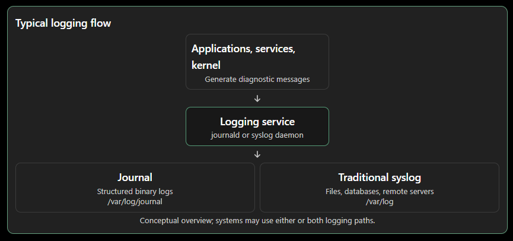
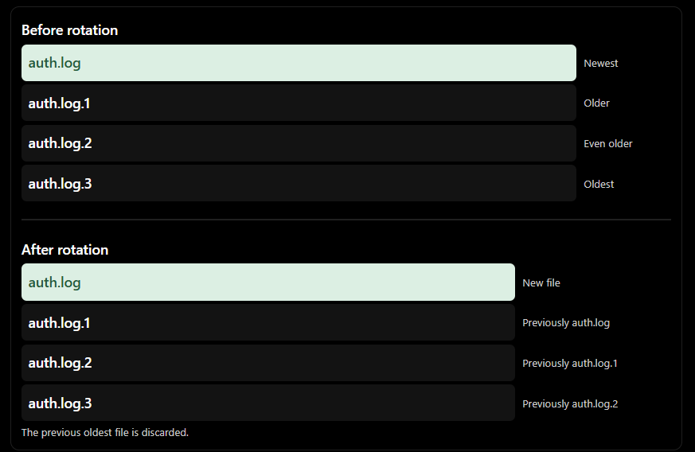

# 7.1 System Logging — Linux Notes

Based on How Linux Works by Brian Ward, this section covers Linux system logging, `journald`, traditional `syslog`, log filtering and monitoring, log rotation, journal maintenance, and the underlying logging architecture.

# 1. Overview of Linux System Logging

System logging records diagnostic messages generated by system programs, services, and the kernel. Logs are essential for troubleshooting, monitoring, and investigating system behavior.

Two major logging approaches are used in Linux:

- Traditional syslog: Uses a syslog daemon such as `rsyslogd` or `syslog-ng` to receive messages and route them to files, databases, or other destinations.
    
- systemd-journald: A logging service provided by systemd that collects and organizes log messages, storing them in a structured, searchable journal.

- Typical logging flow:



### Common log message fields

A typical log entry looks like this:

```
Aug 19 17:59:48 duplex sshd[484]: Server listening on 0.0.0.0 port 22.
```

|Field|Example|Description|
|---|---|---|
|Timestamp|`Aug 19 17:59:48`|Date and time when the message was generated or recorded|
|Hostname|`duplex`|Host that generated the log|
|Process|`sshd`|Name of the process generating the message|
|PID|`484`|Process ID|
|Message|`Server listening on 0.0.0.0 port 22.`|Diagnostic information|
|Facility|`auth`, `kern`, etc.|General category identifying the source|
|Severity|`err`, `warning`, etc.|Urgency of the message|

Facility and severity may be included in the log metadata rather than displayed in the text.

# 2. Checking Your Logging Setup

Linux distributions use different logging configurations. Some use only `journald`, while others run `journald` alongside a traditional syslog daemon.

### How to identify the logging setup

1. Check for journald: Run `journalctl`. If journald is active and accessible, it displays journal messages through a pager.
    
2. Check for rsyslog: Look for the `rsyslogd` process and the `/etc/rsyslog.conf` configuration file.
    
3. Check for syslog-ng: If `rsyslogd` is absent, look for `/etc/syslog-ng`.
    
4. Inspect `/var/log`: Examine logfiles and directories maintained by syslog and other services.
    

### Important log locations

|Path|Description|
|---|---|
|`/var/log/`|Traditional system log directory|
|`/var/log/journal/`|Persistent binary journal storage, when configured|
|`/etc/rsyslog.conf`|Main rsyslog configuration file|
|`/etc/syslog-ng/`|syslog-ng configuration directory|
|`/var/log/wtmp`|Login and logout history data, accessed by tools such as `last`|
|`/var/log/lastlog`|Information about users' most recent logins|
|`/etc/systemd/journald.conf`|Main journald configuration file|

Note: `wtmp` and `lastlog` are maintained by other utilities and are not necessarily ordinary syslog output files.

# 3. Searching and Monitoring Logs with journalctl

`journalctl` is the primary command-line tool for accessing and filtering systemd journal messages.

Without arguments, it displays the journal from oldest to newest, usually through a pager such as `less`.

## 3.1 Basic journal access

```
journalctl
```

Displays journal messages, generally in chronological order, beginning with the oldest available entries.

```
journalctl _PID=8792
```

Displays journal messages associated with process ID `8792`.

The journal supports searching by individual fields, making it possible to narrow down results without scanning every message.

## 3.2 Filtering by time

Time-based filtering is useful when investigating an incident within a known time window.

```
journalctl -S -4h
```

Displays messages from the past four hours.

```
journalctl -S 06:00:00
```

Displays messages since 6:00 AM on the current day.

```
journalctl -S 2020-01-14
```

Displays messages starting from January 14, 2020.

```
journalctl -S '2020-01-14 14:30:00'
```

Displays messages starting from the specified date and time.

```
journalctl -S '2020-01-14 14:30:00' -U '2020-01-14 15:30:00'
```

Displays messages between the specified start and end times.

- `-S`: Specifies the starting time (`--since`).
    
- `-U`: Specifies the ending time (`--until`).
    

## 3.3 Filtering by systemd unit

When troubleshooting a specific service, filtering by unit helps isolate relevant logs.

```
journalctl -u cron.service
```

Displays journal messages associated with `cron.service`.

```
journalctl -u cron
```

The `.service` suffix can generally be omitted.

```
journalctl -F _SYSTEMD_UNIT
```

Lists the values available for the `_SYSTEMD_UNIT` journal field, helping identify unit names that have logged messages.

## 3.4 Discovering journal fields

Journal entries contain structured metadata in addition to their visible message text.

```
journalctl -N
```

Lists the available journal fields.

```
journalctl -F _SYSTEMD_UNIT
```

Lists distinct values found for the `_SYSTEMD_UNIT` field.

Trusted fields: Journal fields beginning with an underscore, such as `_SYSTEMD_UNIT`, are trusted metadata fields. A client sending a message cannot directly alter these fields.

This makes trusted fields useful for filtering logs based on information collected by journald rather than on arbitrary message content.

## 3.5 Filtering by text and regular expressions

```
journalctl -g 'kernel.*memory'
```

Searches journal messages using a regular expression. This example matches messages containing `kernel` followed later by `memory`.

The `-g` option requires a version of `journalctl` built with the relevant library and may not be available on every distribution.

Troubleshooting tip: Text filtering returns only matching messages. Important events may appear immediately before or after a match. Use the matching timestamp with `-S` to inspect surrounding activity.

## 3.6 Filtering by boot

Journald can organize logs by individual system boot sessions.

```
journalctl -b
```

Displays messages from the current boot.

```
journalctl -b -1
```

Displays messages from the previous boot.

```
journalctl --list-boots
```

Lists recorded boot sessions, including their offsets, boot IDs, and time ranges.

```
journalctl -b <boot-id>
```

Displays messages from the boot session identified by the specified boot ID.

```
journalctl -r -b -1
```

Displays messages from the previous boot in reverse chronological order, starting with the newest.

This is useful when checking the events leading up to a shutdown. For example, entries such as `Journal stopped`, `Sending SIGTERM to remaining processes`, and `Syncing filesystems` may indicate a normal shutdown sequence.

## 3.7 Filtering kernel messages

```
journalctl -k
```

Displays kernel messages from the journal.

```
journalctl -k -b
```

Displays kernel messages from the current boot.

Kernel logs can be useful when investigating hardware issues, driver failures, boot problems, and other low-level system events.

## 3.8 Filtering by severity

Journald supports filtering messages by priority (severity).

|Priority|Name|Description|
|---|---|---|
|0|`emerg`|System is unusable|
|1|`alert`|Immediate action required|
|2|`crit`|Critical conditions|
|3|`err`|Error conditions|
|4|`warning`|Warning conditions|
|5|`notice`|Normal but significant conditions|
|6|`info`|Informational messages|
|7|`debug`|Debugging messages|

```
journalctl -p 3
```

Displays messages with priority 3 or higher urgency (priorities 0 through 3).

```
journalctl -p 2..3
```

Displays messages with priorities 2 and 3 only.

Important: Lower numeric values represent higher urgency. Filtering by severity can reduce noise, but informational and warning messages may also contain useful troubleshooting details.

## 3.9 Monitoring logs in real time

Traditional plaintext logfiles can be monitored with:

```
tail -f /var/log/syslog
```

This follows new entries as they are appended to the specified file.

Another option is:

```
less +F /var/log/syslog
```

This follows the file in a mode similar to `tail -f`.

For journald, use:

```
journalctl -f
```

Displays new journal messages as they arrive.

You can combine follow mode with filters:

```
journalctl -u ssh.service -f
```

Monitors new journal messages associated with the SSH service.

Real-time monitoring is particularly useful when observing service startup, reproducing errors, or troubleshooting an application as it runs.

# 4. Logfile Rotation

Traditional syslog-based systems commonly store messages in plaintext logfiles. As logs accumulate, they consume disk space. Log rotation addresses this by dividing log history into multiple files and removing old data according to a configured policy.

The common utility used for this is `logrotate`.

### Example rotation sequence

Suppose a system maintains the following files:

```
/var/log/auth.log
/var/log/auth.log.1
/var/log/auth.log.2
/var/log/auth.log.3
```

The files contain progressively older messages as their suffix numbers increase.

During rotation:

1. The oldest file, `auth.log.3`, is removed.
    
2. `auth.log.2` is renamed to `auth.log.3`.
    
3. `auth.log.1` is renamed to `auth.log.2`.
    
4. `auth.log` is renamed to `auth.log.1`.
    
5. A new `auth.log` is created when the logging process next opens the file.
    


### Compression and naming

Log rotation behavior varies across distributions and configurations.

- Compression: Older logs may be compressed, for example as `.gz` files, to save disk space.
    
- Date suffixes: Some configurations use dates in filenames, such as `auth.log-20200529`, making logs easier to associate with a particular period.
    
- Retention: Old files are eventually deleted according to the rotation policy.
    

### What happens when a logfile is rotated while in use?

Linux allows a process to continue writing to an open file even after the file has been renamed.

Two scenarios are possible:

- If a logging process already has the logfile open when rotation occurs, it may continue writing to the same underlying file, which now has a different filename.
    
- If the process opens the logfile after rotation, it can create or write to the new file under the original name.
    

This behavior explains why logging daemons may need to be notified or configured to reopen logfiles after rotation.

# 5. Journal Maintenance

Unlike traditional text logfiles, journald manages its own stored journal files and can remove older messages based on configured storage limits.

Journald's retention and storage decisions can depend on:

- Available free space on the filesystem.
    
- The maximum amount of filesystem space the journal is allowed to use.
    
- A configured maximum journal size.
    
- The maximum permitted age of log messages.
    

The relevant configuration is documented in the `journald.conf(5)` manual page.

The journal's binary storage format and built-in maintenance mechanisms mean that traditional `logrotate` is not required for journald's own journal files.

# 6. How System Logging Works

## 6.1 Traditional syslog architecture

Syslog originated to provide a standardized mechanism for Unix programs to record diagnostic messages.

Traditional syslog follows a client-server architecture:

- Clients: Applications and system components that generate log messages.
    
- Server: A syslog daemon that receives, processes, and routes messages.
    
- Transport: Messages can be delivered through a local Unix domain socket or, when configured, a network socket.
    
- Destinations: Logfiles, consoles, databases, remote logging systems, and other configured destinations.
    

The traditional local socket used by syslog is:

```
/dev/log
```

A syslog daemon can also listen for messages over a network, allowing multiple machines to send logs to a centralized logging server.

This architecture is particularly useful for environments with many servers and network devices.

## 6.2 Syslog facilities and priorities

Syslog classifies messages using facility and severity values.

Facility identifies the general category of the service or component generating a message. Examples include:

- Kernel
    
- Mail system
    
- Printer
    

Severity indicates the urgency of a message, with levels ranging from 0 (most urgent) to 7 (least urgent).

The combination of facility and severity forms a message priority in the traditional syslog protocol.

In journald, severity is commonly referred to as priority. For example, when viewing journal output in JSON format, the priority field represents the severity level.

## 6.3 Structured logging

Modern logging systems may include structured data in addition to plain text messages.

RFC 5424 provides a mechanism for including structured data as arbitrary key-value pairs.

Structured data can make it easier to:

- Extract specific fields.
    
- Search and filter events.
    
- Send log records to databases.
    
- Analyze application activity programmatically.
    

Although journald can work with structured data, the book notes that this type of information is commonly sent to other logging and database systems.

## 6.4 Syslog versus journald

|Feature|Traditional syslog (`rsyslogd`, `syslog-ng`)|`systemd-journald`|
|---|---|---|
|Primary role|Receive, process, and route log messages|Collect and organize system log messages|
|Storage|Commonly plaintext files; can also use other destinations|Structured journal files|
|Local collection|Yes|Yes|
|Centralized logging|Supports forwarding and aggregation|Often relies on forwarding to another logger|
|Filtering|Depends on daemon and tools|Supports structured field and time filtering through `journalctl`|
|Service output|Depends on integration|Can collect output from systemd-managed services|
|Maintenance|Often uses `logrotate` for files|Built-in retention and storage management|
|Typical configuration|`/etc/rsyslog.conf`, `/etc/syslog-ng/`|`/etc/systemd/journald.conf`|

### Why traditional syslog is still used

The book identifies two main reasons:

1. Centralized logging: Syslog has established methods for collecting logs from multiple machines onto a central server.
    
2. Modularity and integration: Implementations such as `rsyslogd` support different output formats and destinations, including databases and journal-compatible formats.
    

By comparison, journald focuses on collecting and organizing log output from a single machine. It can also forward data to other logging systems for more complex processing.

# 7. Logging Security and Reliability

Logging systems are useful only when their records are sufficiently trustworthy and available.

### Traditional logging limitations

Historically, syslog did not provide strong authentication or encryption by default. This created risks such as:

- Message authenticity: A receiving system might not be able to verify that a message genuinely came from the claimed application or host.
    
- Confidentiality: Unencrypted network traffic could be intercepted.
    
- Log integrity: Without suitable protections, an attacker with sufficient access could alter or delete records.
    
- Source verification: Even when a host is authenticated, identifying whether a particular application truly generated a message can be difficult.
    

Contemporary syslog implementations provide standardized approaches for encrypting messages and authenticating originating machines. However, application-level trust remains a separate concern.

### Modern logging considerations

As systems and applications become more complex, logging requirements have expanded beyond simply writing messages to files.

Modern logging workflows often need to support:

- Centralized collection.
    
- Searching and extracting fields.
    
- Automated analysis.
    
- Long-term retention.
    
- Access controls and trustworthy records.
    
- Integration with databases and monitoring platforms.
    

These capabilities are particularly important when logs are used for incident investigation, operational monitoring, or security analysis.