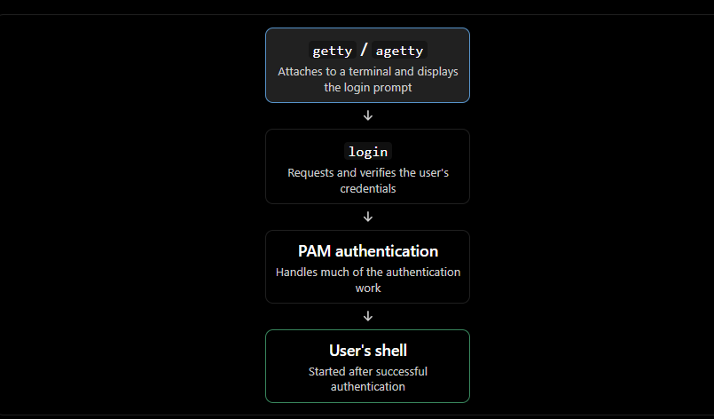

# Linux System Configuration: `/etc`, User Management, and Login

Based on the provided How Linux Works excerpt, these notes cover the structure of `/etc`, Linux user and group management files, password handling, and the login process.

## 1. Structure of `/etc`

- `/etc` is the primary directory for system configuration files in Linux.
    
- Historically, configuration files for almost every program and service were placed directly in `/etc`.
    
- This created two major problems:
    
    - Difficult to locate: Finding a particular configuration file became increasingly difficult as the directory accumulated files.
        
    - Configuration overwrites: Distribution upgrades could overwrite custom changes made directly to configuration files.
        
    

### Modern configuration organization

- Most configuration files are now organized into subdirectories under `/etc`.
    
- Customizations can often be placed in separate files rather than modifying the main configuration.
    
- This makes configuration management easier and helps preserve local changes during software upgrades.
    

Examples:

- `/etc/systemd/` — systemd configuration.
    
- `/etc/grub.d/` — GRUB configuration scripts and customization files.
    
- `/etc/passwd` — local user account information.
    
- `/etc/network/` — network configuration.
    

### What belongs in `/etc`?

|Configuration type|Typical location|Purpose|
|---|---|---|
|Machine-specific configuration|`/etc`|Customizable settings for an individual machine|
|User account information|`/etc/passwd`|Maps usernames to user IDs and stores account details|
|Network configuration|`/etc/network/`|Network-related configuration|
|Systemd configuration and overrides|`/etc/systemd/`|Local systemd configuration|
|Distribution-provided system defaults|`/usr/lib/systemd/`|Packaged systemd unit files and defaults|

Key distinction: `/etc` is primarily for machine-specific, customizable configuration. General application defaults and packaged files that are not intended to be customized are generally stored elsewhere.

## 2. Linux User Management

Linux supports multiple independent users. The kernel identifies users by numeric user IDs (UIDs), while people and user-space applications typically work with usernames.

- Username: Human-readable account identifier.
    
- UID: Numeric identifier used by the kernel to identify a user.
    
- GID: Numeric identifier for a group associated with the user.
    
- User space: The environment in which usernames are managed and mapped to numeric IDs.
    

Applications translate usernames into UIDs when interacting with the kernel.

## 3. The `/etc/passwd` File

The `/etc/passwd` file is a plaintext file that maps usernames to UIDs and contains other account information.

Example:

```
root:x:0:0:Superuser:/root:/bin/sh
daemon:*:1:1:daemon:/usr/sbin:/bin/sh
nobody:*:65534:65534:nobody:/home:/bin/false
juser:x:3119:1000:J. Random User:/home/juser:/bin/bash
```

Each line represents one user account. Fields are separated by colons (`:`).

### Seven fields of `/etc/passwd`

EXAMPLE ENTRY

juser:x:3119:1000:J. Random User:/home/juser:/bin/bash

|   |   |   |
|---|---|---|
|Field|Value|Meaning|
|1|juser|Username / login name|
|2|x|Password placeholder; actual password is in `/etc/shadow`|
|3|3119|UID: numeric user identifier|
|4|1000|GID: primary group identifier|
|5|J. Random User|GECOS: real name and optional descriptive information|
|6|/home/juser|User's home directory|
|7|/bin/bash|Login shell|

### Important password field values

|Value|Meaning|
|---|---|
|`x`|Password information is stored in `/etc/shadow`.|
|`*`|User cannot log in using this password field.|
|Blank (`::`)|No password is required for login through mechanisms that honor the blank password. This is insecure.|

- Passwords are not stored as plaintext.
    
- Password authentication uses a derived password representation rather than the original password.
    
- `/etc/shadow` normally stores the password hashes and related password-aging information.
    
- Normal users generally do not have permission to read `/etc/shadow`.
    

### Special users

|User|UID|Purpose|
|---|---|---|
|`root`|`0`|Superuser account with special privileges|
|`daemon`|`1`|Example of a system account used for services|
|`nobody`|`65534`|Underprivileged account sometimes used to run processes|

Pseudo-users:

- Accounts that generally cannot log in interactively.
    
- Used by system services and processes.
    
- Often created to limit the privileges of processes.
    
- Their special behavior is largely a user-space convention, not a special kernel identity.
    
- The kernel gives UID `0` its special superuser meaning; other UIDs do not inherently have special privileges.
    

### Account considerations

- Duplicate UIDs are possible but can cause confusion for administrators and software.
    
- The primary GID should correspond to a group defined in `/etc/group`.
    
- An account entry can be recognized even if its home directory does not exist.
    
- Network-based identity systems such as NIS and LDAP can provide user accounts without local entries in `/etc/passwd`.
    

## 4. The `/etc/shadow` File

`/etc/shadow` contains authentication information corresponding to user accounts, including:

- Password hashes.
    
- Password expiration information.
    
- Other password-aging details.
    

### Why `/etc/shadow` exists

Historically, password information was stored in `/etc/passwd`. This exposed password-derived values to users who could read the file.

The shadow password system separates password information from general account details:

- `/etc/passwd` contains account information accessible to ordinary users.
    
- `/etc/shadow` contains sensitive authentication information and is restricted to privileged access.
    
- PAM (Pluggable Authentication Modules) handles much of the modern authentication process.
    

Security takeaway: Restrict access to password hashes and avoid blank password fields. Password hashes are not plaintext passwords, but weak passwords may still be vulnerable to guessing or cracking.

## 5. Manipulating Users and Passwords

Linux provides dedicated commands for managing user accounts and their attributes.

- `passwd` — changes a user's password.
    
- `chfn` — changes a user's real name and related GECOS information.
    
- `chsh` — changes a user's login shell.
    
- `adduser` — adds a user.
    
- `userdel` — removes a user.
    
- `vipw` — safely edits `/etc/passwd`.
    
- `vipw -s` — safely edits `/etc/shadow`.
    

Some of these utilities use SUID-root permissions so that ordinary users can perform authorized account changes that require privileged file access.

### Why direct editing is discouraged

Although `/etc/passwd` is a regular plaintext file, directly modifying it is risky:

- A malformed entry may break account-related functionality.
    
- Concurrent modifications can cause inconsistent changes.
    
- Incorrect edits can affect authentication or account access.
    

If direct editing is unavoidable, `vipw` provides file locking and backup precautions. The corresponding shadow-file editing option is `vipw -s`.

## 6. Working with Groups

Linux groups allow multiple users to share access to files and resources.

- Groups are used with file permission bits to control access.
    
- A user has a primary group specified by the GID in `/etc/passwd`.
    
- Users can also belong to additional groups.
    
- Linux distributions often create a separate group for each newly created user.
    

### The `/etc/group` File

The `/etc/group` file defines group names, GIDs, and additional group members.

Example:

```
root:*:0:juser
daemon:*:1:
bin:*:2:
sys:*:3:
adm:*:4:
disk:*:6:juser,beazley
nogroup:*:65534:
user:*:1000:
```

Each entry consists of four colon-separated fields.

|Field|Example|Description|
|---|---|---|
|Group name|`disk`|Human-readable group name|
|Group password|`*`|Generally unused; `*` indicates a disabled password|
|GID|`6`|Numeric group identifier; should be unique|
|Additional members|`juser,beazley`|Optional comma-separated list of group members|

Important group membership detail:

A user can belong to a group in two ways:

- The user's primary GID in `/etc/passwd` matches the group's GID.
    
- The username appears in the additional members field in `/etc/group`.
    

The group password mechanism is rarely used. The source recommends using `sudo` as a better alternative in most cases.

### Login process


### Process behavior

1. `getty` attaches to a terminal and presents a login prompt.
    
2. After the user enters a username, `getty` replaces itself with the `login` program.
    
3. `login` prompts for a password and handles authentication, much of which is delegated to PAM.
    
4. If authentication succeeds, `login` replaces itself with the user's configured shell using `exec()`.
    
5. If authentication fails, the user receives a login error message.
    

Modern Linux systems:

- `agetty` is a common implementation of `getty`.
    
- Virtual terminals typically use `getty` for console logins.
    
- Many users instead log in through graphical display managers such as GDM or remotely through SSH.
    
- Virtual terminals ignore the baud rate, although a baud rate may still appear in terminal configuration for compatibility with physical serial terminals.