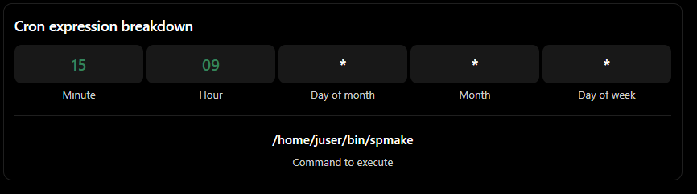

# Linux System Configuration: Time Management, cron, and systemd Timer Units

Based on the provided How Linux Works excerpt, these notes cover Linux system time, hardware clocks, time zones, network time synchronization, recurring task scheduling with cron, and systemd timer units.

## 1. Setting the System Time

Linux depends on accurate timekeeping for logging, scheduled tasks, and system operations.

### System clock vs. hardware clock

Linux uses two important clocks:

- System clock (kernel clock):

- Maintained by the Linux kernel.
    
- Used by commands such as `date`.
    
- Represents time internally as seconds since January 1, 1970, UTC.
    
- Can drift over time, especially on systems that remain running for long periods.
    

- Real-time clock (RTC):

- A battery-backed hardware clock found on PCs.
    
- Maintains time even when the system is powered off.
    
- The kernel normally initializes its system clock using the RTC during boot.


### Synchronizing the clocks

The hardware clock is not perfectly accurate, and the kernel clock can drift over time.

To synchronize the RTC with the current system clock, use:

```
sudo hwclock --systohc --utc
```

- `--systohc`: Copies system time to the hardware clock.
    
- `--utc`: Interprets the hardware clock as UTC.
    

Important:

- Keeping the RTC in UTC avoids complications involving time zones and daylight saving time.
    
- Avoid repeatedly correcting time drift by abruptly resetting the system clock with `hwclock`.
    
- Sudden time changes can disrupt time-based events.
    
- A network time daemon is generally the preferred way to keep the system clock accurate.
    
- `adjtimex` is mentioned as a utility that can adjust clock timing more smoothly.
    

## 2. Kernel Time Representation and Time Zones

The kernel represents time as the number of seconds since midnight, January 1, 1970, UTC. This is commonly known as the Unix epoch.

### Unix timestamp

To display the current Unix timestamp:

```
date +%s
```

Example output:

```
1791025200
```

This number represents a point in time, independent of the local time zone used to display it.

### How Linux handles time zones

- The kernel maintains time independently of local time-zone display.
    
- User-space programs convert timestamps into human-readable local time.
    
- Time-zone rules account for local offsets and daylight saving time.
    
- `/etc/localtime` controls the system's local time zone.
    
- Time-zone data files are stored in `/usr/share/zoneinfo`.
    

### Setting the time zone

A system administrator can configure the time zone by copying or linking an appropriate time-zone file to `/etc/localtime`, or by using the distribution's time-zone utility.

For example:

```
sudo ln -sf /usr/share/zoneinfo/America/Vancouver /etc/localtime
```

The `tzselect` command can help identify the appropriate time-zone file.

### Setting a temporary time zone

You can override the time zone for a shell session using the `TZ` environment variable.

```
export TZ=US/Central
date
```

This changes the time zone used by commands launched from that shell session.

Alternatively, apply the time zone to just one command:

```
TZ=US/Central date
```

This does not permanently change the system's time zone.

## 3. Network Time Synchronization

Linux systems can synchronize their clocks using the Network Time Protocol (NTP).

NTP allows a machine to obtain accurate time from remote time servers.

### Common time synchronization services

|Service|Description|
|---|---|
|`systemd-timesyncd`|systemd's time synchronization service, commonly enabled by default on many distributions|
|`ntpd`|Traditional NTP daemon used for synchronizing system time|
|`chronyd`|Time synchronization daemon that can help maintain accurate time, including during network disconnections|

### systemd-timesyncd

- Commonly included in Linux distributions using systemd.
    
- Synchronizes system time with remote time servers.
    
- Usually enabled by default.
    
- Can be configured through its configuration file and distribution-specific settings.
    

Configuration file:

```
/etc/systemd/timesyncd.conf
```

The excerpt identifies changing the remote time servers as a common configuration override. Refer to `timesyncd.conf(5)` for the available options.

### chronyd

For systems without a permanent internet connection, `chronyd` can help maintain time during periods of disconnection.

### Synchronizing RTC with network time

Once the system clock has been synchronized with network time, you can copy that time to the hardware clock:

```
sudo hwclock --systohc --utc
```

This helps maintain time consistency across reboots.

## 4. Scheduling Recurring Tasks with cron

Linux provides two main mechanisms for scheduling recurring tasks:

- cron: A traditional scheduler that runs commands at specified times.
    
- systemd timer units: A systemd-based scheduling mechanism that activates service units.
    

Recurring tasks are useful for automating system maintenance, log rotation, backups, and other periodic operations.

### Understanding cron syntax

A cron job is a scheduled command defined in a crontab file.

Example:

```
15 09 * * * /home/juser/bin/spmake
```

This runs `/home/juser/bin/spmake` every day at 9:15 AM in the local time zone.



### The five cron fields

|Field|Allowed values|Description|
|---|---|---|
|Minute|`0–59`|Minute of the hour|
|Hour|`0–23`|Hour of the day (24-hour format)|
|Day of month|`1–31`|Day within the month|
|Month|`1–12`|Month of the year|
|Day of week|`0–7`|Day of the week; both `0` and `7` represent Sunday|

### Special characters

|Character|Meaning|Example|
|---|---|---|
|`*`|Matches every possible value in the field|`* * * * *`|
|`,`|Specifies multiple values|`5,14`|
|`-`|Specifies a range of values|`1-5`|
|`/`|Specifies intervals or step values|`*/10`|

The excerpt specifically demonstrates the wildcard and comma syntax. The range and step examples are additional common cron syntax.

### Common cron examples

|Cron expression|Description|
|---|---|
|`15 09 * * *`|Every day at 9:15 AM|
|`15 09 14 * *`|At 9:15 AM on the 14th of every month|
|`15 09 5,14 * *`|At 9:15 AM on the 5th and 14th of every month|
|`0 0 * * *`|Every day at midnight|
|`*/10 * * * *`|Every 10 minutes|
|`0 8 * * 1-5`|At 8 AM, Monday through Friday|

Important: Cron jobs generally use the local time zone. Their execution can be affected by changes in the system clock and time zone.

### Cron output and errors

Cron can send job output and error information to the job owner's email address, assuming email delivery is configured.

Example:

```
15 09 * * * /home/juser/bin/spmake > /tmp/spmake.log 2>&1
```

- `>` redirects standard output to a file.
    
- `2>&1` redirects standard error to the same destination as standard output.
    
- The log file can be used to inspect the job's output later.
    

To discard output instead:

```
15 09 * * * /home/juser/bin/spmake > /dev/null 2>&1
```

This suppresses both standard output and standard error.

## 5. Installing and Managing Crontab Files

Each user can maintain their own crontab file.

- User crontabs are managed using the `crontab` command.
    
- The command installs, lists, edits, and removes scheduled jobs.
    
- The system normally stores user crontabs in a spool directory, such as `/var/spool/cron/crontabs`.
    
- Ordinary users cannot directly write to this directory.
    

### Managing a user's crontab

|Command|Description|
|---|---|
|`crontab -l`|Lists the current user's scheduled cron jobs|
|`crontab -e`|Opens the current user's crontab for editing|
|`crontab -r`|Removes the current user's crontab|
|`crontab file`|Installs the specified file as the current user's crontab|

Example crontab file:

```
# Run a script daily at 9:15 AM
15 09 * * * /home/juser/bin/spmake

# Run a backup every Sunday at midnight
0 0 * * 0 /home/juser/bin/backup.sh
```

Install it using:

```
crontab myjobs
```

The `crontab` command validates the crontab format during installation.

For routine changes, `crontab -e` is generally more convenient because it allows editing and installation in one step.

## 6. System Crontab Files

In addition to individual user crontabs, Linux distributions commonly provide system-wide cron configuration.

### `/etc/crontab`

The system crontab uses a slightly different format from a regular user crontab.

It has an additional field specifying the user under which the command should run.

Example:

```
42 6 * * * root /usr/local/bin/cleansystem > /dev/null 2>&1
```

This runs `/usr/local/bin/cleansystem` as `root` at 6:42 AM every day.

Difference between user and system crontabs:

```
User crontab:
42 6 * * * /usr/local/bin/cleansystem

System crontab:
/etc/crontab:
42 6 * * * root /usr/local/bin/cleansystem
```

The user crontab implicitly runs jobs as its owner. The system crontab explicitly specifies the execution user.

### Additional system cron locations

|Location|Purpose|
|---|---|
|`/etc/crontab`|Main system-wide cron configuration|
|`/etc/cron.d/`|Additional system cron files using the system crontab format|
|`/etc/cron.daily/`|Scripts commonly executed by a scheduled daily cron job|
|`/var/spool/cron/crontabs/`|Typical storage location for individual user crontabs|

Some distributions use additional cron directories, such as `/etc/cron.hourly`, `/etc/cron.weekly`, and `/etc/cron.monthly`.

Troubleshooting takeaway: When investigating a scheduled system task, check both the crontab files and the scripts invoked by them. A script in `/etc/cron.daily` may be executed by a separate scheduled entry rather than having its own cron expression.

## 7. systemd Timer Units

systemd timer units provide an alternative to cron for scheduling recurring tasks.

A systemd timer does not directly contain the command to execute. Instead, it activates another unit, usually a service unit.

For a new scheduled task, you typically create two files:

- Timer unit (`.timer`): Defines when the task should run.
    
- Service unit (`.service`): Defines what the task should execute.


Both custom unit files in the example are stored in:

```
/etc/systemd/system/
```

### Timer unit example: `loggertest.timer`

```
[Unit]
Description=Example timer unit

[Timer]
OnCalendar=*-*-* *:00,20,40
Unit=loggertest.service

[Install]
WantedBy=timers.target
```

#### Configuration breakdown

|Section / parameter|Example|Explanation|
|---|---|---|
|`[Unit]`||General unit metadata and dependencies|
|`Description`|`Example timer unit`|Human-readable description|
|`[Timer]`||Timer-specific configuration|
|`OnCalendar`|`*-*-* *:00,20,40`|Triggers at minute 0, 20, and 40 of every hour, every day|
|`Unit`|`loggertest.service`|Specifies the unit activated by this timer|
|`[Install]`||Installation and enablement configuration|
|`WantedBy`|`timers.target`|Allows the timer to be enabled as part of the system's timer target|

### Understanding `OnCalendar`

The `OnCalendar` field resembles cron syntax but uses a calendar-based date and time expression.

General format:

```
Year-Month-Day Hour:Minute:Second
```

Example:

```
OnCalendar=*-*-* *:00,20,40
```

|Component|Value|Meaning|
|---|---|---|
|Year|`*`|Every year|
|Month|`*`|Every month|
|Day|`*`|Every day|
|Hour|`*`|Every hour|
|Minute|`00,20,40`|At minute 0, 20, and 40|
|Second|Omitted|Uses the default second value|

An alternative expression is:

```
OnCalendar=*-*-* *:00/20
```

The `/20` interval indicates every 20 minutes, producing the same schedule in this example.

### Service unit example: `loggertest.service`

```
[Unit]
Description=Example Test Service

[Service]
Type=oneshot
ExecStart=/usr/bin/logger -p local3.debug "I'm a logger"
```

#### Configuration breakdown

|Section / parameter|Example|Explanation|
|---|---|---|
|`[Unit]`||General unit metadata and dependency configuration|
|`Description`|`Example Test Service`|Human-readable description of the service|
|`[Service]`||Defines how the service runs|
|`Type`|`oneshot`|Indicates that the service runs a task and exits rather than remaining active|
|`ExecStart`|`/usr/bin/logger -p local3.debug "I'm a logger"`|Command executed when the service is activated|
|`-p`|`local3.debug`|Specifies the syslog facility and priority|

Why use `Type=oneshot` for scheduled tasks?

- The service is expected to execute a command and terminate.
    
- systemd considers the service started only after the `ExecStart` command completes.
    
- Multiple `ExecStart` commands can be specified for a oneshot service.
    
- It can simplify strict dependency ordering when combined with directives such as `Wants` and `Before`.
    
- systemd records start and completion information in the journal.
    

### Timer and service unit relationship

When the timer and service share the same base name, systemd can automatically associate them.

For example:

```
loggertest.timer
loggertest.service
```

The timer can omit the `Unit=` option because systemd looks for the corresponding service unit with the same base name. Specifying `Unit=` explicitly is also valid.

### A potential logging race condition

In the example, the service runs `logger` and exits very quickly.

There is a potential race condition:

1. The service executes the `logger` command.
    
2. The message is sent to the logging system.
    
3. The service exits.
    
4. journald may receive the message after the service has already finished.
    
5. journald may be unable to associate the message with the service unit because the process ID is no longer available for the association.
    

As a result, a message might not contain the expected systemd unit field. This can affect filtering with commands such as:

```
journalctl -f -u loggertest.service
```

This issue is less likely to be noticeable in longer-running services.

## 8. cron vs. systemd Timer Units

Both cron and systemd timers can schedule recurring tasks, but their configuration and management differ.

|Feature|cron|systemd timer units|
|---|---|---|
|Configuration|Simple, compact scheduling expressions|Separate timer and service unit configuration|
|Third-party compatibility|Widely supported by existing services|Depends on systemd integration|
|User scheduling|Easy for users to install personal tasks|Requires managing systemd units|
|Process tracking|Traditional process management|Better tracking through systemd and cgroups|
|Diagnostic information|Output can be emailed or redirected to logs|Integrates with the systemd journal|
|Scheduling options|Standard cron scheduling syntax|Additional calendar-based activation options|
|Dependencies|Limited integration with system dependencies|Supports systemd dependencies and activation mechanisms|
|Task definition|Command is specified in the crontab entry|Command is defined separately in the service unit|

### When to use each

cron is useful when:

- You need a simple recurring command.
    
- You want compatibility with existing scripts and third-party services.
    
- You want users to manage their own scheduled tasks easily.
    

systemd timers are useful when:

- You want scheduled tasks integrated with systemd.
    
- You need better process tracking and diagnostic information.
    
- You want to take advantage of systemd dependencies and activation mechanisms.
    
- You need more flexible scheduling options.
    

Neither mechanism is universally better. The choice depends on the task and the system's existing configuration.

## Key takeaways

- System time vs. RTC: The kernel maintains the system clock, while the hardware RTC preserves time across shutdowns.
    
- UTC and time zones: Keeping the hardware clock in UTC avoids many time-zone and daylight saving complications. Local time is handled through time-zone data.
    
- Network synchronization: NTP-based services such as systemd-timesyncd and chronyd help prevent clock drift.
    
- cron: A straightforward way to schedule recurring commands using five time fields.
    
- System crontab: Unlike user crontabs, system-wide cron entries include an explicit execution user.
    
- systemd timers: Separate scheduling logic (`.timer`) from task execution (`.service`).
    
- Oneshot services: Particularly useful for scheduled jobs that run a command and exit.
    
- Logging and observability: systemd timers provide integration with the journal and process tracking, while cron offers a simple and widely compatible scheduling mechanism.