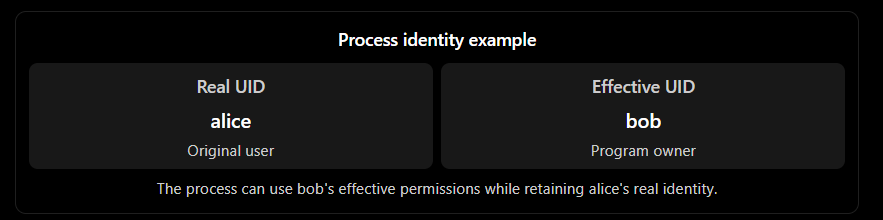
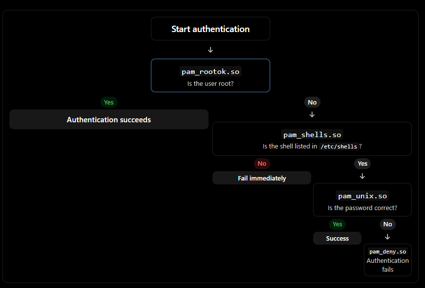

# Linux Notes: User Access, User IDs, Authentication, and PAM

Based on How Linux Works by Brian Ward, Sections 7.9–7.10.3.

# 1. User Access and User Switching

Linux provides mechanisms that allow processes to temporarily switch user identities and operate with different permissions.

Two primary mechanisms enable user switching:

- Setuid executables: Executable files with the setuid permission bit, which can run with the effective UID of the file's owner.
    
- `setuid()` system calls: Kernel interfaces that allow a process to change its user IDs, subject to permission restrictions.
    

## 1.1 How User Switching Works

The Linux kernel enforces rules governing changes to process user IDs.

|Rule|Explanation|
|---|---|
|Setuid executable|A process can execute a setuid program if it has sufficient file permissions.|
|Root privileges|A process running as root (UID 0) can use `setuid()` to switch to another user.|
|Regular user restrictions|A non-root process has severe restrictions on using `setuid()` and generally cannot switch to arbitrary users.|

Example: How `sudo` switches users

1. A regular user executes `sudo`.
    
2. The `sudo` executable has the setuid permission and runs with elevated effective privileges.
    
3. `sudo` performs the necessary checks and uses system calls to change the process's user identity.
    
4. The requested command runs with the target user's privileges.
    

```
$ ls -l /usr/bin/sudo
-rwsr-xr-x 1 root root ... /usr/bin/sudo
```

The `s` in the owner's execute position indicates that the setuid bit is enabled.

Important distinction: User switching at the kernel level is fundamentally about numeric user IDs, not usernames or passwords. Usernames and authentication are handled in user space.

# 2. Process Ownership and User IDs

Linux processes can have multiple user IDs. Understanding these IDs is important when investigating process permissions, ownership, and privilege changes.

## 2.1 Types of User IDs

|User ID|Abbreviation|Purpose|
|---|---|---|
|Real User ID|RUID (`ruid`)|Identifies the user who initiated the process.|
|Effective User ID|EUID (`euid`)|Determines the process's access rights, especially for file permissions.|
|Saved User ID|SUID|Allows a process to switch its effective UID back to a previously saved identity, subject to kernel rules.|
|Filesystem User ID|FSUID (`fsuid`)|Determines the user identity used for filesystem permission checks. Rarely used directly.|

### Real UID vs. Effective UID

Think of the distinction as follows:

- RUID = Who started the process.
    
- EUID = Which user's permissions the process currently uses.
    

Normally, these values are identical.

However, when a user executes a setuid program owned by another user, Linux can change the EUID while preserving the original RUID.

Example:

Suppose user `alice` executes a setuid program owned by `bob`.



The real UID also plays a role in determining who can send signals to or terminate a process. For example, user `alice` can generally signal a process she started even if that process has a different effective UID, subject to the applicable permission rules.

## 2.2 Viewing Real and Effective User IDs

Use `ps` to inspect process ownership.

```
$ ps -eo pid,euser,ruser,comm
```

|Option|Explanation|
|---|---|
|`-e`|Selects all processes.|
|`-o`|Specifies the output format.|
|`pid`|Displays the process ID.|
|`euser`|Displays the effective username.|
|`ruser`|Displays the real username.|
|`comm`|Displays the command name.|

Example output:

```
    PID EUSER    RUSER    COMMAND
   1024 root     root     systemd
   2048 alice    alice    bash
   3090 bob      alice    example
```

The third process illustrates a difference between the real and effective users.

## 2.3 Typical Setuid Program Behavior

Some setuid programs explicitly change both the effective and real UIDs using system calls.

For example, `sudo` typically changes the process identity to avoid unintended side effects and access problems that can arise when the real and effective UIDs differ.

The book describes a `sudoers` setting that can prevent this behavior:

```
Defaults stay_setuid
```

This setting belongs in `/etc/sudoers`.

It instructs `sudo` to preserve the setuid behavior instead of changing the real UID in the usual way. Be cautious when using it because it can affect other programs executed through `sudo`.

## 2.4 Security Implications of Setuid

Setuid programs are security-sensitive because they can execute with privileges beyond those of the user who launches them.

Example of a dangerous configuration:

```
# A hypothetical setuid-root shell copy
-rwsr-xr-x 1 root root ... /tmp/bash
```

If a local user can execute a setuid-root shell, they may obtain root privileges.

Risks include:

- Unnecessary setuid-root executables.
    
- Vulnerabilities in privileged programs.
    
- Incorrect privilege transitions.
    
- Excessive permissions granted to local users.
    

Security takeaway: Minimize the number of privileged executables and carefully review what they do, because vulnerabilities in setuid-root programs can lead to complete system compromise.

# 3. User Identification, Authentication, and Authorization

A multiuser Linux system needs three fundamental security mechanisms.

|Concept|Question it answers|Purpose|
|---|---|---|
|Identification|Who are you?|Establishes a user's identity, typically through a username mapped to a numeric UID.|
|Authentication|Can you prove who you are?|Verifies identity using passwords, tokens, keys, or other methods.|
|Authorization|What are you allowed to do?|Determines which resources and operations a user can access.|

## 3.1 The Kernel's Role

The Linux kernel primarily deals with numeric UIDs and permission enforcement.

- Identification: The kernel associates processes and files with numeric user IDs.
    
- Authentication: The kernel does not directly handle usernames and password verification.
    
- Authorization: The kernel enforces access rules, including file permissions and restrictions on changing user IDs.
    

Most authentication logic operates in user space.

## 3.2 Mapping a UID to a Username

On a traditional Unix system, applications can retrieve user information from `/etc/passwd`.

The book describes a simplified process:

1. Call `geteuid()` to retrieve the process's effective UID.
    
2. Open `/etc/passwd`.
    
3. Read the file line by line.
    
4. Split each line into fields using colons.
    
5. Compare the third field (UID) against the effective UID.
    
6. If the IDs match, retrieve the username from the first field.
    

Example `/etc/passwd` entry:

```
alice:x:1000:1000:Alice:/home/alice:/bin/bash
```

|Field|Value|Meaning|
|---|---|---|
|1|`alice`|Username|
|2|`x`|Password placeholder; password hashes are typically stored in `/etc/shadow`.|
|3|`1000`|User ID (UID)|
|4|`1000`|Primary group ID (GID)|
|5|`Alice`|User information or comment|
|6|`/home/alice`|Home directory|
|7|`/bin/bash`|Login shell|

The kernel works with the numeric UID rather than needing to know the username.

# 4. Using Libraries for User Information

Instead of manually parsing `/etc/passwd`, applications can use standard library functions to retrieve user information.

Two important functions are:

|Function|Purpose|
|---|---|
|`geteuid()`|Retrieves the effective UID of the calling process.|
|`getpwuid()`|Retrieves the user account information associated with a specified UID.|

Example in C:

```c
#include <stdio.h>
#include <unistd.h>
#include <pwd.h>

int main(void) {
    uid_t uid = geteuid();
    struct passwd *user = getpwuid(uid);

    if (user != NULL) {
        printf("Username: %s\n", user->pw_name);
    }

    return 0;
}
```

Explanation:

- `geteuid()` retrieves the effective UID.
    
- `getpwuid(uid)` looks up the corresponding user account.
    
- `pw_name` contains the username.
    

## 4.1 Why Standard Libraries Matter

Standard libraries provide a consistent interface for retrieving user information.

For example, the underlying user database can be changed from local `/etc/passwd` entries to a network directory service such as LDAP, without requiring every application to implement a new lookup mechanism.

This abstraction separates applications from the details of the user information source.

## 4.2 Limitations of Traditional Password Verification

Historically, password verification relied on encrypted password information stored in `/etc/passwd`.

This approach had several limitations:

- No centralized system-wide standard for password encryption.
    
- Applications needed access to encrypted password information.
    
- Users could be repeatedly prompted for passwords.
    
- Supporting alternative authentication methods, such as smart cards or biometrics, required additional implementation.
    

The shadow password system addressed some of these limitations by separating password information from ordinary account data.

However, the need for flexible authentication mechanisms led to the development of PAM.

# 5. Pluggable Authentication Modules (PAM)

PAM (Pluggable Authentication Modules) is a framework that allows applications to use different authentication mechanisms through dynamically loadable modules.

Instead of implementing authentication independently, an application delegates authentication tasks to PAM.


PAM provides several benefits:

- Supports multiple authentication methods.
    
- Allows authentication mechanisms to be changed without modifying every application.
    
- Supports dynamically loadable modules.
    
- Provides some authorization and account-management controls for services.
    

For example, `pam_unix.so` can verify a user's password using the Unix password system.

## 5.1 PAM Configuration Files

PAM configuration is usually stored in:

```
/etc/pam.d/
```

Each file typically corresponds to an application or service.

Examples:

```
/etc/pam.d/login
/etc/pam.d/passwd
/etc/pam.d/cron
/etc/pam.d/chsh
/etc/pam.d/other
```

Older systems may use a single `/etc/pam.conf` file instead.

The exact rules vary between Linux distributions.

## 5.2 PAM Configuration Syntax

Each basic PAM configuration line has three main fields:

```
type    control    module
```

Example:

```
auth    requisite    pam_shells.so
```

|Field|Example|Explanation|
|---|---|---|
|Function type|`auth`|Specifies the type of operation PAM should perform.|
|Control argument|`requisite`|Determines how PAM proceeds after the module succeeds or fails.|
|Module|`pam_shells.so`|Specifies the module that performs the operation.|

In this example, `pam_shells.so` checks whether the user's shell is listed in `/etc/shells`. Because the control argument is `requisite`, failure causes PAM to reject the request immediately.

## 5.3 PAM Function Types

PAM supports four main function types.

|Function type|Purpose|Example use|
|---|---|---|
|`auth`|Authenticates the user.|Verifying a password.|
|`account`|Checks account status and access eligibility.|Checking whether an account is permitted to access a service.|
|`session`|Performs tasks related to a user's session.|Displaying a message of the day.|
|`password`|Changes passwords or other credentials.|Setting a new password.|

The function type and module must be considered together to understand a rule.

For example:

```
auth       sufficient    pam_unix.so
password   sufficient    pam_unix.so
```

- The `auth` rule uses `pam_unix.so` to verify a password.
    
- The `password` rule uses `pam_unix.so` to set or change a password.
    

The same module can perform different tasks depending on the function type.

# 6. PAM Control Arguments and Stacked Rules

One of PAM's most important features is its ability to stack multiple rules for the same function.

PAM processes rules in sequence. Each rule's control argument determines whether processing continues, succeeds, or fails.

## 6.1 The Three Major Simple Control Arguments

|Control argument|On success|On failure|
|---|---|---|
|`sufficient`|Can immediately return success if no previous required rule has failed.|Continues to the next rule.|
|`requisite`|Continues to the next rule.|Immediately returns failure.|
|`required`|Continues to the next rule.|Records failure but continues processing; the overall result will be failure.|

Important: A `required` failure does not immediately stop PAM processing. Later modules still execute, but they cannot make the overall result successful.

## 6.2 Example: PAM Authentication Stack

Consider this example configuration for the `chsh` authentication function:

```
auth    sufficient    pam_rootok.so
auth    requisite     pam_shells.so
auth    sufficient    pam_unix.so
auth    required      pam_deny.so
```

Each line performs a different task.

|Rule|Module|Control|Purpose|
|---|---|---|---|
|1|`pam_rootok.so`|`sufficient`|Allows root to succeed without further authentication if the module succeeds.|
|2|`pam_shells.so`|`requisite`|Rejects the request immediately if the user's shell is not listed in `/etc/shells`.|
|3|`pam_unix.so`|`sufficient`|Allows successful password verification to complete authentication, provided no previous required failure exists.|
|4|`pam_deny.so`|`required`|Always fails, providing a final denial when earlier authentication rules did not succeed.|

## 6.3 Authentication Flow



This example illustrates the control flow described in the book. It is an educational configuration, not a recommendation to replace a distribution's existing PAM rules.

## 6.4 Advanced Control Syntax

PAM also supports an advanced control syntax using square brackets.

This syntax allows administrators to specify different actions for particular module return values, rather than relying only on the simple `required`, `requisite`, and `sufficient` controls.

Example structure:

```
auth    [success=1 default=ignore]    pam_unix.so
```

- `success=1`: On success, skip the next rule.
    
- `default=ignore`: For other return values, ignore the result for purposes of the overall stack decision.
    

The exact behavior depends on the specified return-value mappings and the remaining rules in the stack.

Refer to `pam.conf(5)` for the full advanced syntax.

## 6.5 PAM Module Arguments

PAM modules can accept additional arguments after the module name.

Example:

```
auth    sufficient    pam_unix.so    nullok
```

The `nullok` argument permits authentication with an empty password under the module's applicable conditions.

Without this argument, a user with no password would normally fail authentication through this module.

Security note: Allowing empty-password authentication can introduce serious security risks. Avoid enabling it unless there is a specific, carefully controlled requirement.

# 7. PAM Configuration Tips and Troubleshooting

PAM configuration has rule ordering, control flow, module arguments, and external configuration dependencies. Understanding these elements is essential when troubleshooting authentication problems.

## 7.1 Finding PAM Modules

Use the following commands to locate module documentation and files.

```
$ man -k pam_
```

Searches manual page descriptions for PAM-related entries.

```
$ locate pam_unix.so
```

Searches the system's file index for the `pam_unix.so` module.

```
$ man pam_unix
```

Displays the manual page for the Unix authentication module, if available.

## 7.2 Default PAM Configuration

The file `/etc/pam.d/other` provides default PAM rules for applications or services that do not have their own PAM configuration file.

A common security approach is to deny authentication by default.

Example illustrative configuration:

```
auth       required    pam_deny.so
account    required    pam_deny.so
password   required    pam_deny.so
session    required    pam_deny.so
```

This example denies all four PAM function types. Actual distribution defaults may include additional rules.

## 7.3 Including Other Configuration Files

PAM supports including rules from other configuration files.

Example:

```
@include common-auth
```

This loads the rules from `common-auth`, a convention used by some distributions.

The exact include syntax and file organization vary between distributions.

Some configurations also use `include` or `substack` as control arguments to incorporate rules for specific function types.

## 7.4 PAM and `/etc/security`

Some PAM modules use additional configuration files located under:

```
/etc/security/
```

These files can contain additional restrictions or per-user settings.

Therefore, reviewing only `/etc/pam.d/` may not reveal every authentication or account restriction applied to a service.

# 8. PAM and Password Configuration

Linux has several password-related configuration mechanisms. Understanding how they interact helps avoid confusion when examining password verification and password changes.

## 8.1 `/etc/login.defs`

The `/etc/login.defs` file belongs to the traditional shadow password suite.

It includes password-related settings, such as the encryption algorithm configuration used by older password-management tools.

On systems using PAM, this file is less central because password-setting behavior is generally controlled by PAM configuration.

However, its settings may still matter for applications that do not use PAM.

## 8.2 Checking PAM Password-Setting Rules

To locate password-related `pam_unix.so` rules, use:

```
$ grep password.*unix /etc/pam.d/*
```

Example output:

```
/etc/pam.d/common-password:password sufficient pam_unix.so obscure sha512
```

The example contains two module arguments:

|Argument|Explanation|
|---|---|
|`obscure`|Applies password-quality checks to the new password, including checks against certain similarities to the old password.|
|`sha512`|Specifies SHA-512-based password hashing for new passwords through this module's password-setting operation.|

The exact arguments and supported password-hashing methods depend on the installed PAM implementation and distribution.

## 8.3 Password Setting vs. Password Verification

An important distinction is that password setting and password verification are separate PAM operations.

|Operation|PAM function|Example behavior|
|---|---|---|
|Set a password|`password`|Uses configured arguments such as `obscure` and `sha512` when creating a new password hash.|
|Verify a password|`auth`|Checks a supplied password against the stored password hash.|

For `pam_unix.so`, the password-verification function generally determines the appropriate hash method from the stored password hash rather than requiring the administrator to specify a hashing algorithm in the `auth` rule.

This is why the password-setting configuration does not necessarily tell you which algorithm is used to verify every existing password.

---

Key concepts to remember

- UIDs: The kernel uses numeric user IDs to enforce process and file permissions.
    
- RUID vs. EUID: The real UID identifies the process's originating user, while the effective UID determines its effective access privileges.
    
- Setuid: Allows an executable to run with the effective UID of its owner, making privileged setuid programs security-sensitive.
    
- PAM: Provides a flexible authentication framework through configurable rules and dynamically loaded modules.
    
- PAM control arguments: Determine how success or failure in one rule affects the remaining authentication stack.
    
- Password configuration: Distinguish between password-setting rules and password-verification behavior.
